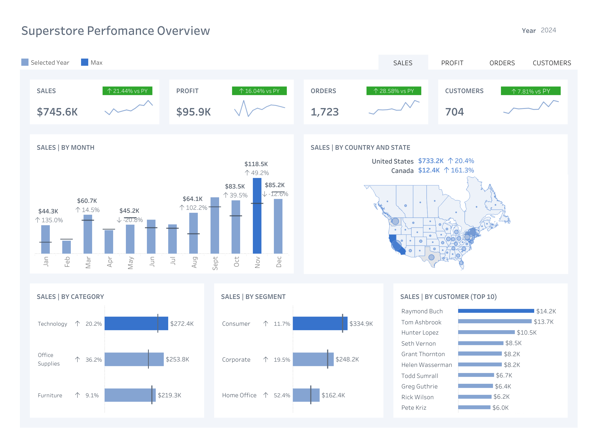
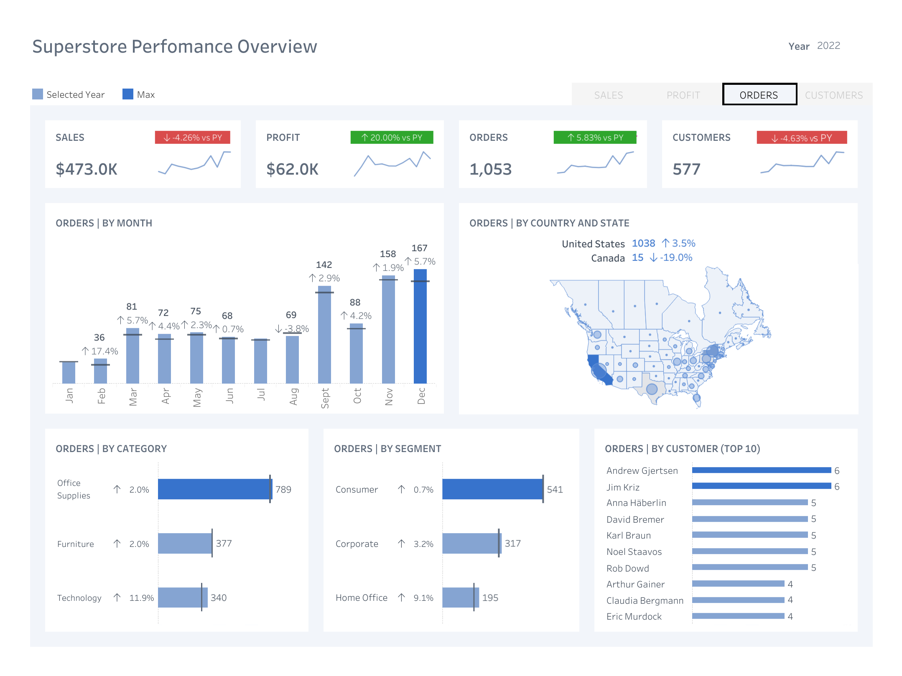

# Store Sales Performance Dashboard  

## Overview  
This project showcases an interactive **Tableau dashboard** analyzing store sales performance. The dashboard provides key insights into **sales, profit, orders, and customer trends** across multiple dimensions.  

## Features  
- 📊 **Total KPIs** with trends and year-over-year comparisons  
- 🔄 **Dynamic filters** to switch between years and metrics  
- 🔍 **Detailed insights** on sales, profit, orders, and customer data  
- 🛠 **Interactive tooltips** for additional information  

## Live Dashboard  
🔗 **Explore the interactive Tableau dashboard:** [View on Tableau Public](https://lnkd.in/eRAYcvW4)  

## Screenshots  

   

## Dataset  
This dashboard is based on the **Tableau Superstore dataset**.  

